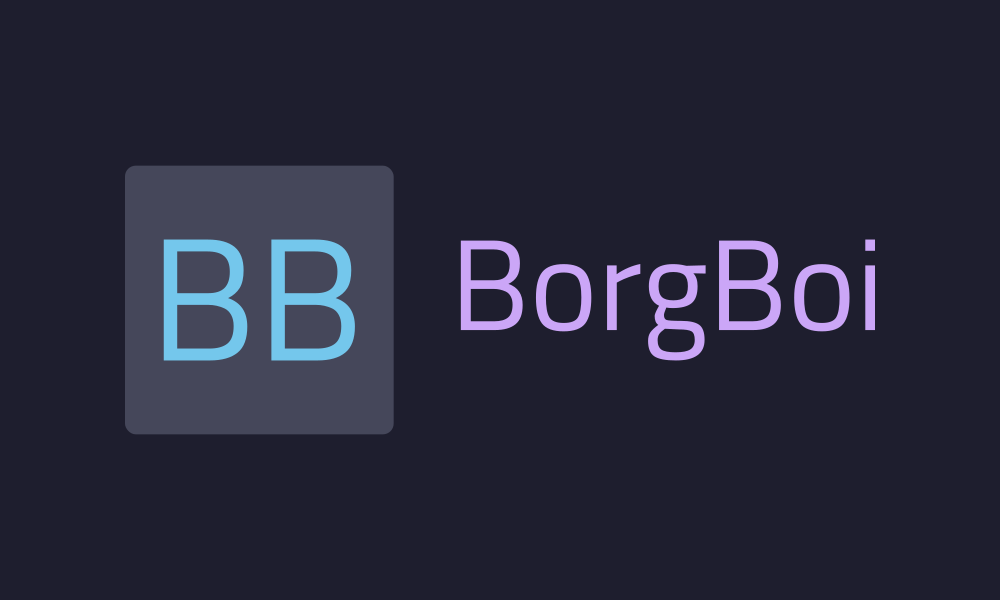

# BorgBoi Docs

??? info "BorgBackup - The engine behind BorgBoi"
    This project wouldn't be possible without the underlying technology that is **BorgBackup** or Borg for short.
    >BorgBackup (short: Borg) is a deduplicating backup program. Optionally, it supports compression and authenticated encryption.
    >The main goal of Borg is to provide an efficient and secure way to backup data. The data deduplication technique used makes Borg suitable for daily backups since only changes are stored. The authenticated encryption technique makes it suitable for backups to not fully trusted targets.

    Their full documentation is available here: [https://borgbackup.readthedocs.io](https://borgbackup.readthedocs.io/en/stable/index.html).

## What is BorgBoi?

BorgBoi is a thin wrapper around the BorgBackup tool that adds both a scriptable CLI and an interactive terminal dashboard.

It contains the following features:

* Daily backup command that **creates** a new archive, **prunes** stale archives, and **compacts** the Borg repository to free up space
* Metadata about your Borg repositories is stored in DynamoDB (or locally in offline mode)
* Borg repositories are synced with S3 to enable cloud backups and archive restoration from other systems
* **Offline mode** support for users who prefer not to use AWS services
* **Cyclopts-powered CLI** with rich help output, global root flags, and organized subcommands (`repo`, `backup`, `s3`, `exclusions`, `config`, `tui`, `version`)
* **Textual TUI** for browsing repositories, opening a live config sidebar, and managing excludes files without leaving the terminal
* **Secure passphrase management** with file-based storage and auto-generation

## Quick Start

```sh
# Explore the generated CLI help
bb --help
bb repo --help

# Launch the interactive TUI
bb tui

# Enable shell completion (optional but recommended)
bb --install-completion

# Create a new repository
bb repo create --path /opt/borg-repos/docs \
    --backup-target ~/Documents \
    --name my-docs-backup

# Create the exclusions file required by backup commands
bb exclusions create --path /opt/borg-repos/docs \
    --source ~/borgboi-excludes.txt

# Run a daily backup
bb backup daily --name my-docs-backup

# List all repositories
bb repo list

# View archives in a repository
bb backup list --name my-docs-backup

# Show the installed version
bb version
```

## Installation

BorgBoi isn't published to PyPI yet, so it is recommended to install it with [`uv`](https://docs.astral.sh/uv/).

```sh
uv tool install git+https://github.com/fullerzz/borgboi
```

Additionally, **BorgBackup** needs to be installed on your system for BorgBoi to work.

Read installation methods here: [https://borgbackup.readthedocs.io/en/stable/installation.html](https://borgbackup.readthedocs.io/en/stable/installation.html).

## GitHub Repo

[https://github.com/fullerzz/borgboi](https://github.com/fullerzz/borgboi)

For the interactive terminal workflow, see the [TUI guide](pages/tui.md).

{ loading=lazy }
