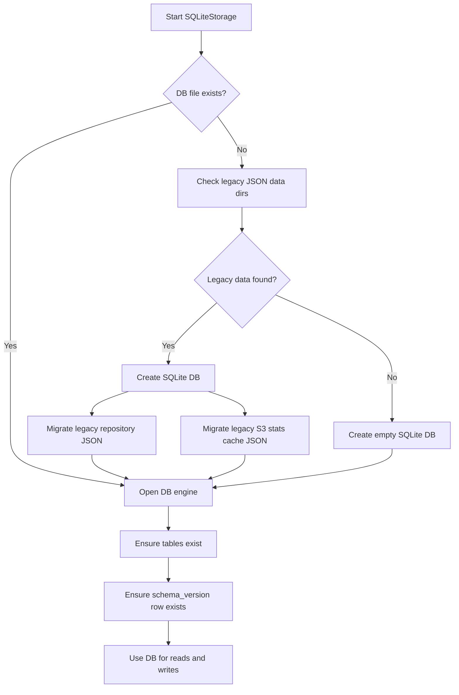
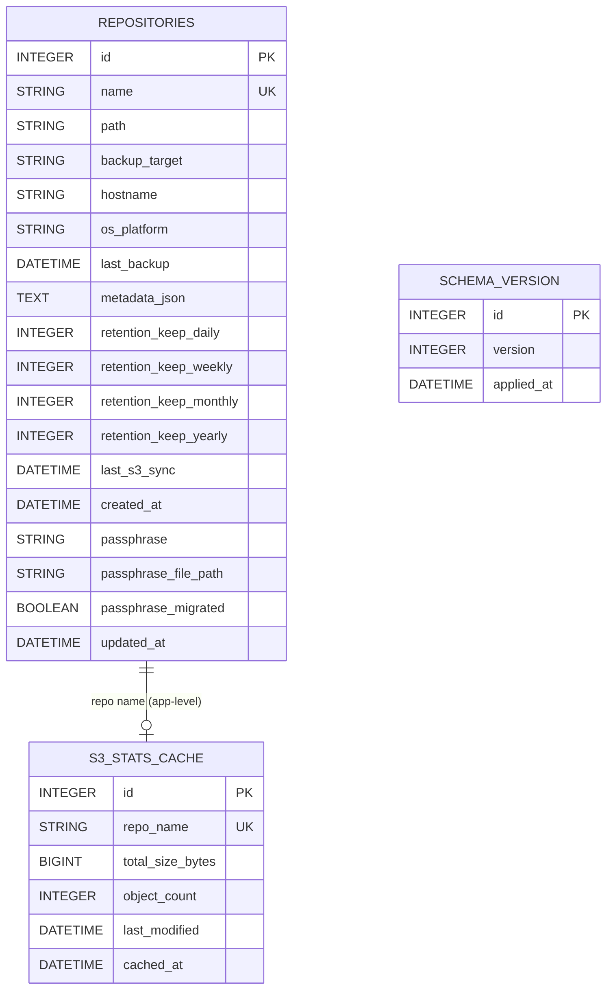

# SQLite Database

BorgBoi uses SQLite for local metadata and cache storage. The database file is:

- `~/.borgboi/borgboi.db`

If `BORGBOI_HOME` is set, the path becomes:

- `$BORGBOI_HOME/.borgboi/borgboi.db`

## What SQLite Stores

SQLite stores:

- Repository metadata (`repositories`)
- Cached S3 statistics (`s3_stats_cache`)
- Storage schema version (`schema_version`)

It does **not** store the Borg repository contents themselves. Actual backup archives remain in Borg repositories on disk (and optionally S3).

## Database Lifecycle



## Schema Overview



!!! note "Relationship model"
    `repositories` and `s3_stats_cache` are related by repository name at the application layer (`repositories.name` <-> `s3_stats_cache.repo_name`).
    The current schema does not define a SQL foreign key constraint for this link.

## Table Details

### `repositories`

Primary table for BorgBoi repository metadata.

| Column | Type | Nullable | Constraints / Behavior |
| --- | --- | --- | --- |
| `id` | `INTEGER` | No | Primary key, auto-increment |
| `name` | `VARCHAR(255)` | No | Unique, indexed |
| `path` | `VARCHAR(1024)` | No | Used with hostname for uniqueness |
| `backup_target` | `VARCHAR(1024)` | No | Filesystem path being backed up |
| `hostname` | `VARCHAR(255)` | No | Indexed |
| `os_platform` | `VARCHAR(10)` | No | Host OS identifier |
| `last_backup` | `DATETIME` | Yes | Last successful backup timestamp |
| `metadata_json` | `TEXT` | Yes | Serialized repository info payload |
| `retention_keep_daily` | `INTEGER` | Yes | Optional per-repo retention override |
| `retention_keep_weekly` | `INTEGER` | Yes | Optional per-repo retention override |
| `retention_keep_monthly` | `INTEGER` | Yes | Optional per-repo retention override |
| `retention_keep_yearly` | `INTEGER` | Yes | Optional per-repo retention override |
| `last_s3_sync` | `DATETIME` | Yes | Last S3 synchronization time |
| `created_at` | `DATETIME` | Yes | Creation timestamp when set |
| `passphrase` | `VARCHAR(512)` | Yes | Legacy/inline passphrase storage |
| `passphrase_file_path` | `VARCHAR(1024)` | Yes | File path to passphrase material |
| `passphrase_migrated` | `BOOLEAN` | No | Defaults to `false` |
| `updated_at` | `DATETIME` | No | Auto-set on write and update |

Additional unique constraint:

- `UNIQUE(path, hostname)` via `uq_repo_path_hostname`

This allows the same `path` string to exist on different hosts while preventing duplicates on the same host.

### `s3_stats_cache`

Caches S3 statistics for each repository to reduce repeated API calls.

| Column | Type | Nullable | Constraints / Behavior |
| --- | --- | --- | --- |
| `id` | `INTEGER` | No | Primary key, auto-increment |
| `repo_name` | `VARCHAR(255)` | No | Unique (one cache row per repository name) |
| `total_size_bytes` | `BIGINT` | No | Defaults to `0` |
| `object_count` | `INTEGER` | No | Defaults to `0` |
| `last_modified` | `DATETIME` | Yes | Last modified timestamp observed in S3 |
| `cached_at` | `DATETIME` | No | Timestamp when cache row was written |

### `schema_version`

Tracks storage schema version.

| Column | Type | Nullable | Constraints / Behavior |
| --- | --- | --- | --- |
| `id` | `INTEGER` | No | Primary key, auto-increment |
| `version` | `INTEGER` | No | Current schema version |
| `applied_at` | `DATETIME` | No | Timestamp when this version row was inserted |

Current initialization behavior inserts version `1` if no row exists.

## Operational Notes

- SQLite is opened with `PRAGMA journal_mode=WAL` to improve concurrent read behavior.
- Tables are created through SQLAlchemy metadata (`create_all`) during initialization.
- Deleting a repository also deletes its `s3_stats_cache` row in application logic.
- Exclusions are not stored in SQLite; they are written to text files under `~/.borgboi/data/exclusions/`.

## Common Introspection Queries

```sql
-- List tables
SELECT name FROM sqlite_master WHERE type = 'table' ORDER BY name;
```

```sql
-- Show repository rows
SELECT id, name, path, hostname, last_backup, updated_at
FROM repositories
ORDER BY name;
```

```sql
-- Show cached S3 stats
SELECT repo_name, total_size_bytes, object_count, cached_at
FROM s3_stats_cache
ORDER BY cached_at DESC;
```

```sql
-- Show schema version row
SELECT id, version, applied_at
FROM schema_version
ORDER BY id DESC;
```
