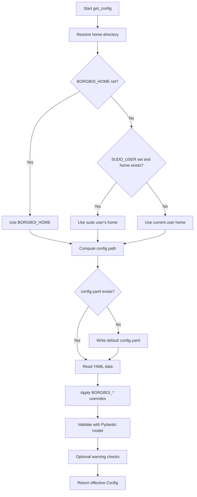
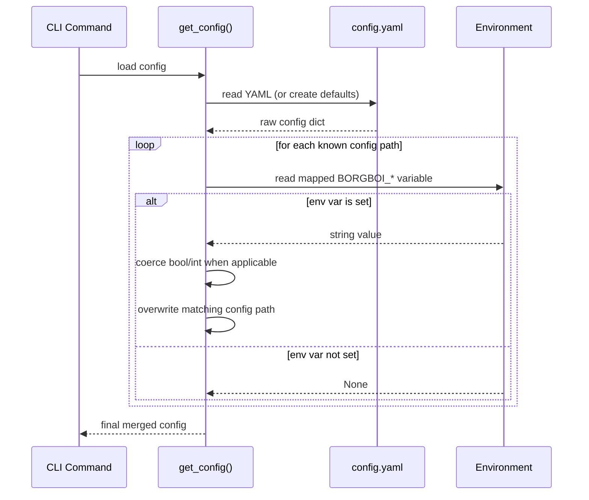

# User Configuration

This page documents every user-facing BorgBoi configuration field, its default, and its allowed values.

## Where Configuration Comes From

BorgBoi loads configuration from:

1. Defaults defined in code
2. `~/.borgboi/config.yaml` (or `BORGBOI_HOME/.borgboi/config.yaml`)
3. `BORGBOI_*` environment variable overrides
4. CLI flags for `--offline` and `--debug` (for command execution)

!!! info "Config file location"
    BorgBoi resolves the home directory in this order:

    1. `BORGBOI_HOME`
    2. `SUDO_USER` home directory (when running under `sudo`)
    3. Current user home (`Path.home()`)

    Then it uses `<resolved-home>/.borgboi/config.yaml`.

## Default `config.yaml`

```yaml
aws:
  dynamodb_repos_table: bb-repos
  dynamodb_archives_table: bb-archives
  s3_bucket: bb-backups
  region: us-west-1

borg:
  executable_path: borg
  default_repo_path: ~/.borgboi/repositories
  compression: zstd,6
  checkpoint_interval: 900
  storage_quota: 100G
  additional_free_space: 2G
  retention:
    keep_daily: 7
    keep_weekly: 4
    keep_monthly: 6
    keep_yearly: 0

ui:
  theme: catppuccin
  show_progress: true
  color_output: true
  table_style: rounded

offline: false
debug: false
```

## Load Flow With Environment Variables





## Allowed Values By Field

### Top-Level Fields

| Key | Type | Default | Allowed Values | Notes |
| --- | --- | --- | --- | --- |
| `offline` | boolean | `false` | `true` or `false` | When `true`, skips AWS usage and uses local metadata storage. |
| `debug` | boolean | `false` | `true` or `false` | Enables debug mode in CLI context. |

### `aws` Section

| Key | Type | Default | Allowed Values | Notes |
| --- | --- | --- | --- | --- |
| `aws.dynamodb_repos_table` | string | `bb-repos` | Any string | Should be a valid DynamoDB table name you can access. |
| `aws.dynamodb_archives_table` | string | `bb-archives` | Any string | Should be a valid DynamoDB table name you can access. |
| `aws.s3_bucket` | string | `bb-backups` | Any string | Should be a valid S3 bucket name you can access. |
| `aws.region` | string | `us-west-1` | Any string | Typically an AWS region like `us-east-1`, `eu-west-1`, etc. |
| `aws.profile` | string or `null` | `null` | Any string or `null` | Optional AWS profile name. |

### `borg` Section

| Key | Type | Default | Allowed Values | Notes |
| --- | --- | --- | --- | --- |
| `borg.executable_path` | string | `borg` | Any string | Command/path used to invoke Borg. Must be executable and in `PATH` unless absolute path is provided. |
| `borg.default_repo_path` | path string | `~/.borgboi/repositories` | Any valid path | Base directory where repos are created by default. |
| `borg.compression` | string | `zstd,6` | `none`, `lz4`, `zstd`, `zlib`, `lzma`, optionally with level like `algorithm,N` | Compression algorithm is validated against the listed algorithms. If level is provided, `N` should be an integer `0-22`. |
| `borg.checkpoint_interval` | integer | `900` | Any integer | Warning is emitted when value is negative. Units are seconds. |
| `borg.storage_quota` | string | `100G` | Any string | Recommended format is Borg size style like `500M`, `100G`, `2T`; invalid-looking formats may trigger warnings. |
| `borg.additional_free_space` | string | `2G` | Any string | Free-space buffer passed to Borg operations that support it. |
| `borg.borg_passphrase` | string or `null` | `null` | Any string or `null` | Default passphrase for existing repos when no higher-priority source is present. |
| `borg.borg_new_passphrase` | string or `null` | `null` | Any string or `null` | Passphrase for new repo initialization when no higher-priority source is present. |

#### `borg.retention` subsection

| Key | Type | Default | Allowed Values | Notes |
| --- | --- | --- | --- | --- |
| `borg.retention.keep_daily` | integer | `7` | Integer `>= 0` | Number of daily archives to keep. |
| `borg.retention.keep_weekly` | integer | `4` | Integer `>= 0` | Number of weekly archives to keep. |
| `borg.retention.keep_monthly` | integer | `6` | Integer `>= 0` | Number of monthly archives to keep. |
| `borg.retention.keep_yearly` | integer | `0` | Integer `>= 0` | Number of yearly archives to keep. |

!!! warning "Retention edge case"
    If all retention values are `0`, BorgBoi warns that archives may accumulate indefinitely.

### `ui` Section

| Key | Type | Default | Allowed Values | Notes |
| --- | --- | --- | --- | --- |
| `ui.theme` | string | `catppuccin` | Any string | Stored in config, but currently not strongly validated at load time. |
| `ui.show_progress` | boolean | `true` | `true` or `false` | Controls whether progress output is shown in relevant operations. |
| `ui.color_output` | boolean | `true` | `true` or `false` | Controls colorized CLI output behavior in supported contexts. |
| `ui.table_style` | string | `rounded` | Any string | Stored in config; currently not strongly validated at load time. |

## Environment Variables

Use `BORGBOI_` variables to override config file values at runtime.

### Home/Config Location

| Environment Variable | Purpose |
| --- | --- |
| `BORGBOI_HOME` | Overrides the home directory used to resolve `.borgboi` paths (including `config.yaml`). |

### Field Override Variables

| Environment Variable | Config Path |
| --- | --- |
| `BORGBOI_OFFLINE` | `offline` |
| `BORGBOI_DEBUG` | `debug` |
| `BORGBOI_AWS__DYNAMODB_REPOS_TABLE` | `aws.dynamodb_repos_table` |
| `BORGBOI_AWS__DYNAMODB_ARCHIVES_TABLE` | `aws.dynamodb_archives_table` |
| `BORGBOI_AWS__S3_BUCKET` | `aws.s3_bucket` |
| `BORGBOI_AWS__REGION` | `aws.region` |
| `BORGBOI_AWS__PROFILE` | `aws.profile` |
| `BORGBOI_BORG__EXECUTABLE_PATH` | `borg.executable_path` |
| `BORGBOI_BORG__DEFAULT_REPO_PATH` | `borg.default_repo_path` |
| `BORGBOI_BORG__COMPRESSION` | `borg.compression` |
| `BORGBOI_BORG__CHECKPOINT_INTERVAL` | `borg.checkpoint_interval` |
| `BORGBOI_BORG__STORAGE_QUOTA` | `borg.storage_quota` |
| `BORGBOI_BORG__ADDITIONAL_FREE_SPACE` | `borg.additional_free_space` |
| `BORGBOI_BORG__BORG_PASSPHRASE` | `borg.borg_passphrase` |
| `BORGBOI_BORG__BORG_NEW_PASSPHRASE` | `borg.borg_new_passphrase` |
| `BORGBOI_BORG__RETENTION__KEEP_DAILY` | `borg.retention.keep_daily` |
| `BORGBOI_BORG__RETENTION__KEEP_WEEKLY` | `borg.retention.keep_weekly` |
| `BORGBOI_BORG__RETENTION__KEEP_MONTHLY` | `borg.retention.keep_monthly` |
| `BORGBOI_BORG__RETENTION__KEEP_YEARLY` | `borg.retention.keep_yearly` |
| `BORGBOI_UI__THEME` | `ui.theme` |
| `BORGBOI_UI__SHOW_PROGRESS` | `ui.show_progress` |
| `BORGBOI_UI__COLOR_OUTPUT` | `ui.color_output` |
| `BORGBOI_UI__TABLE_STYLE` | `ui.table_style` |

### Environment Variable Coercion Rules

When overrides are read from environment variables:

- Boolean values are parsed from: `true`, `1`, `yes`, `false`, `0`, `no` (case-insensitive).
- Integer parsing is applied to:
  - `borg.checkpoint_interval`
  - `borg.retention.keep_daily`
  - `borg.retention.keep_weekly`
  - `borg.retention.keep_monthly`
  - `borg.retention.keep_yearly`
- All other values remain strings.

## Effective-Config Examples

```sh
# Override only offline mode and bucket for this shell
export BORGBOI_OFFLINE=1
export BORGBOI_AWS__S3_BUCKET=my-team-bucket

bb config show --format tree
```

```sh
# Use a custom BorgBoi home directory
export BORGBOI_HOME=/srv/borgboi-user
bb config show
```

```sh
# One-off command-level override (without exporting)
BORGBOI_BORG__COMPRESSION=zstd,9 bb backup daily --path /opt/borg-repos/docs
```

## Validation and Warnings

BorgBoi validates the final merged config and may warn (without failing) for:

- Missing Borg executable in `PATH`
- Invalid compression algorithm
- Negative retention values
- Negative checkpoint interval
- Missing required AWS fields while not in offline mode

Use this command to inspect the effective final values, including env-var sourced values:

```sh
bb config show --format tree
```
